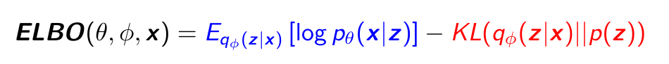
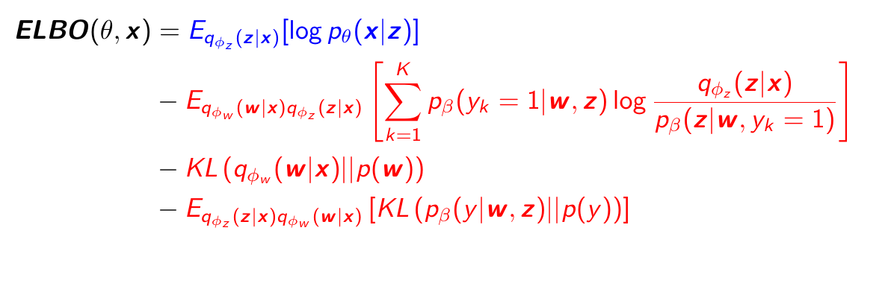

# VAE-GMVAE
This repository contains the implementation of the VAE and Gaussian Mixture VAE using TensorFlow. The VAE implementation  is completeley based on the model described in [link](https://arxiv.org/pdf/1606.05908.pdf) and the GMVAE implementation is based on the model presented in [link](https://arxiv.org/pdf/1611.02648.pdf) with some modifications in the optimization function and the implementation of some distributions. These modifications are described in the Chapter 4 of this bachelor [thesis](https://www.researchgate.net/publication/331089295_Unsupervised_Deep_Learning_Research_and_Implementation_of_Variational_Autoencoders)

## Dependencies
1. Install [Tensorflow](https://www.tensorflow.org/get_started/os_setup)
2. Install [Matplotlib](https://matplotlib.org/index.html)
3. Install [Numpy](http://www.numpy.org/)

## Graphical Model

The image below shows the graphical model for the VAE.The variable x represents the input data and the variable z represents the latent space. The left part is the generative model and the right part is the inference model.

<p align="center">

</p>
The image below shows the graphical model for the GMVAE.The variable x represents the input data and the variables w,y,z represent the latent space. The left part is the generative model and the right part is the inference model.

<p align="center">

</p>

For a complete explanation of both models see Chapter 3 and Chapter 4 of the bachelor thesis (soon available).

## Objective Function

These are the functions that are optimized during training. It can be observed both contains a term that will be maximized (blue) and one or more terms that are regularizers (red).

For the VAE:
<p align="center">

</p>

For the GMVAE:
<p align="center">

</p>

For a complete explanation of both models see Chapter 3 and Chapter 4 of the bachelor thesis (soon available).

## Hyperparameters
The following hyperparameters are defined. Some of them handle the files
generated, others deal with saving and restoring a model and others determine certain aspects
of the algorithm.

Parameters to handle aspects of the training process and the neural networks:
```
  --model_type MODEL_TYPE          Fixes the model and architecture
  --dataset_name DATASET_NAME       MNIST or FREY
  --epochs EPOCHS                   Number of epochs for training
  --batch_size BATCH_SIZE           Number of inputs used for each iteration
  --sigma SIGMA                     Parameter that defines the variance of the output Gaussian distribution
  --learning_rate LEARNING_RATE     Parameter of the optimization function
  --z_dim Z_DIM                     Dimension of the latent variable z
  --w_dim W_DIM                     Dimension of the latent variable w. Only for GMVAE
  --K_clusters K_CLUSTERS           Number of modes of the latent variable z. Only for GMVAE
  --hidden_dim HIDDEN_DIM           Number of neurons of each dense layer
  --num_layers NUM_LAYERS           Number of dense layers in each network
```

Parameters to set  checkpoint, results, log and data directories:

```
  --checkpoint_dir CHECKPOINT_DIR   Directory name to save the checkpoints
  --result_dir RESULT_DIR           Directory name to save the generated images
  --log_dir LOG_DIR                 Directory name to save training logs
  --data_dir DATA_DIR               Directory for storing input data
```
Parameters used to enable/disable training, tensorboard summay, model load, plot and generation of results:
```
  --train TRAIN                     Flag to set train
  --summary SUMMARY                 Flag to set TensorBoard summary
  --restore RESTORE                 Flag to restore model
  --plot PLOT                       Flag to set plot
  --results RESULTS                 Flag to get results
  --early_stopping EARLY_STOPPING   Flag to enable early stopping
```
Other parameters:
```
  --extra EXTRA         Extra name to identify the model
```
## Folder Structure
This project contains the following folders:
- Alg_*: contains the files needed to implement a certain algorithm. These files are described in the following section
- base: base classes for Graph, Model and Visualize
- networks: classes encapsulating the implementation of CNN, dense and RNN networks.
- utils: diverse files to manage arguments, data and training things (early stopping, logger...)

## Main Files
In the models implemented we can differentiate 3 main parts: computation graph (ex. VAE_graph.py), training  (ex. VAE_model.py) and visualization  (ex. VAE_visualize.py).
- XX_graph.py: contains the class that defines the computation graph of the algorithm and methods to obtain specific parameters
- XX_model.py: contains the class that generates the computation graph, defines the training process and the evaluation of the trained model.
- XX_visualize.py: contains the class that contains methods to visualize the results.
- XX_main.py: This is the main file. It manages the arguments, it loads the data and it instantiates the previous objects.

## Architecture selection
The selection of an architecture is done through the model_type parameter. It can take the following values:

- 0: VAE implemented using dense neural networks. [VAE_graph.py]
- 1: VAE implemented using CNNs. [VAECNN_graph.py]
- 2: GMVAE implemented using dense neural networks [GMVAE_graph.py]
- 3: GMVAE implemented using CNNs. [GMVAECNN_graph.py]

## Saved models

Models are saved following the following naming. For the VAE it has 6 fields (+ extra):

```
{model_type}_{dataset_name}_{sigma}_{dim_Z}_{hidden_dim}_{num_layers}
```

For the GMVAE it has the previous field plus "dim_Z" and "K_clusters", which makes 8 in total (+ extra):

```
{model_type}_{dataset_name}_{sigma}_{dim_Z}_{dim_W}_{hidden_dim}_{num_layers}_{K_clusters}
```

Example: V_MNIST_0001_8_64_2
## TensorBoard
It is possible to visualize the evolution of parameters during training and the latent variables in TensorBoard. It can be done executing the tensorboard command indicating the log folder of the trained model:

```
tensorboard--logdir=LOGDIR/MODEL_SAVED/
```

For example, if the following model's configuration is trained:
```
python3 VAE_main.py --model_type=0 --dataset_name=MNIST --sigma=0.001 --z_dim=8 --hidden_dim=64 --num_layers=2 --epochs=20 --batch_size=32 --drop_prob=0.3 --l_rate=0.01 --train=1 --results=1 --plot=1 --restore=1 --early_stopping=1
```
then it is possible to open TensorBoard and see the parameters of the previous model:
```
tensorboard --logdir=./expeiments/summary/V_MNIST_0001_8_64_2/
```
Tensorflow will be opened in a browser and you will see 5 tabs: SCALARS, GRAPHS, DISTRIBUTIONS, HISTOGRAMS AND PROJECTOR. The two screenshots below show the PROJECTOR tab, which shows several inputs images projected in the latent space through t-SNE.

<p align="center">

</p>

<p align="center">

</p>

## Examples of use
Training and results of VAE using MNIST dataset:

```
python3 VAE_main.py --model_type=0 --dataset_name=MNIST --sigma=0.001 --z_dim=8 --hidden_dim=64 --num_layers=2 --epochs=20 --batch_size=32 --drop_prob=0.3 --l_rate=0.01 --train=1 --results=1 --plot=1 --restore=1 --early_stopping=1

```

Load previously trained GMVAECNN using FREY dataset, generate results and plot them:
```
python3 GMVAE_main.py --model_type=3 --dataset_name=FREY --sigma=0.001 --z_dim=8 --w_dim=2 --K_clusters=8 --hidden_dim=64 --num_layers=2 --epochs=20 --batch_size=32 --drop_prob=0.3 --l_rate=0.01 --train=0 --results=1 --plot=1 --restore=1 --early_stopping=1
```
## Results
In the title of the generated images "Images generated by GMVAE X" the "X" refers to the cluster index, not to the actual class.
### VAE
Good generative result:
<p align="center">

</p>

Good clustering result:
<p align="center">

</p>

### VAECNN
<p align="center">

</p>


### GMVAE
<p align="center">

</p>


### GMVAECNN
Using MNIST dataset:
<p align="center">

</p>

Using FREY dataset, the labels have been manually:
<p align="center">

</p>


## Acknowledgments
- C. Doersch, “Tutorial on Variational Autoencoders,” ArXiv e-prints, Jun. 2016. arXiv: <https://arxiv.org/pdf/1606.05908.pdf>
- N. Dilokthanakul et al., “Deep Unsupervised Clustering with Gaussian Mixture Variational Autoencoders,” ArXiv e-prints, Nov. 2016. arXiv: <https://arxiv.org/pdf/1611.02648.pdf>
