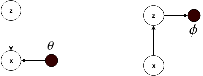
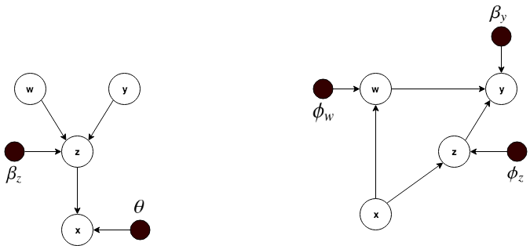
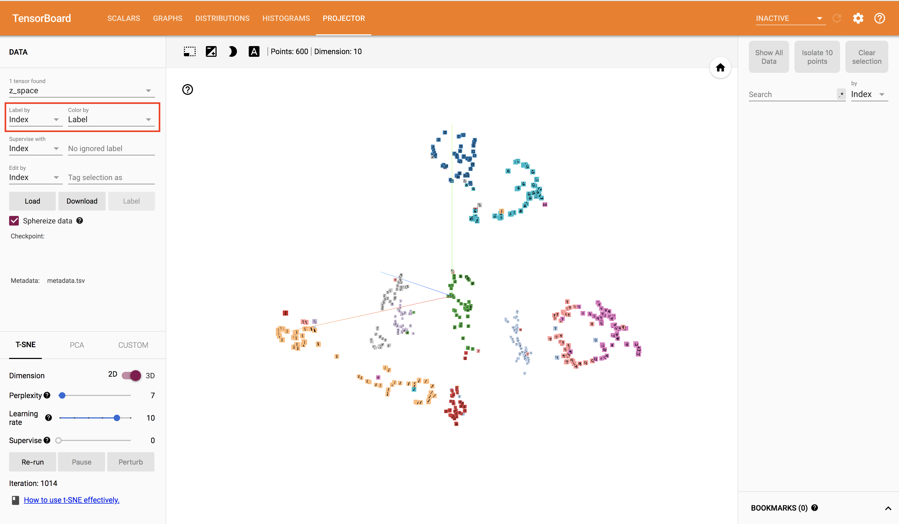
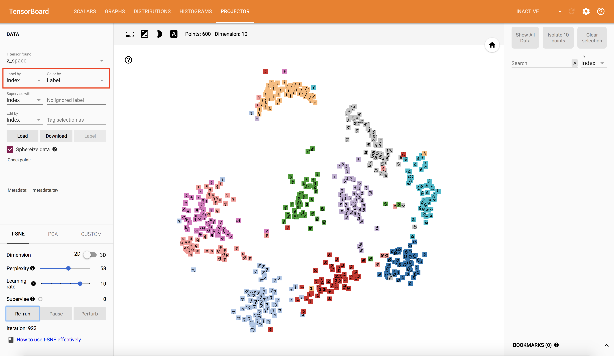
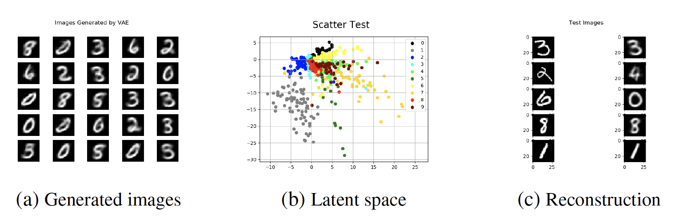
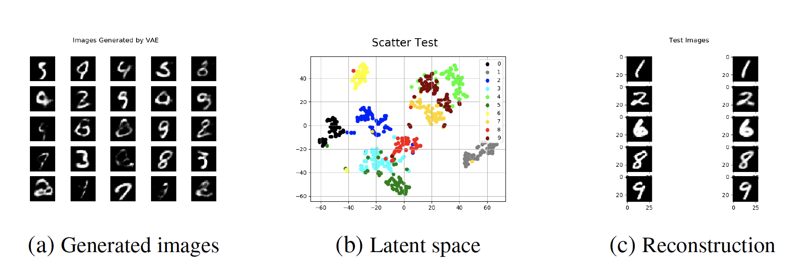
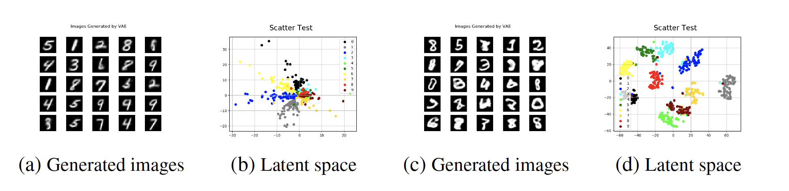
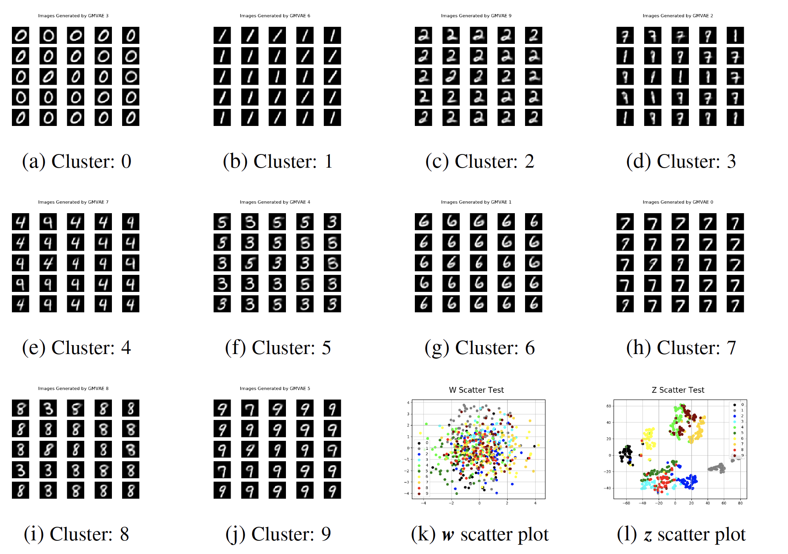
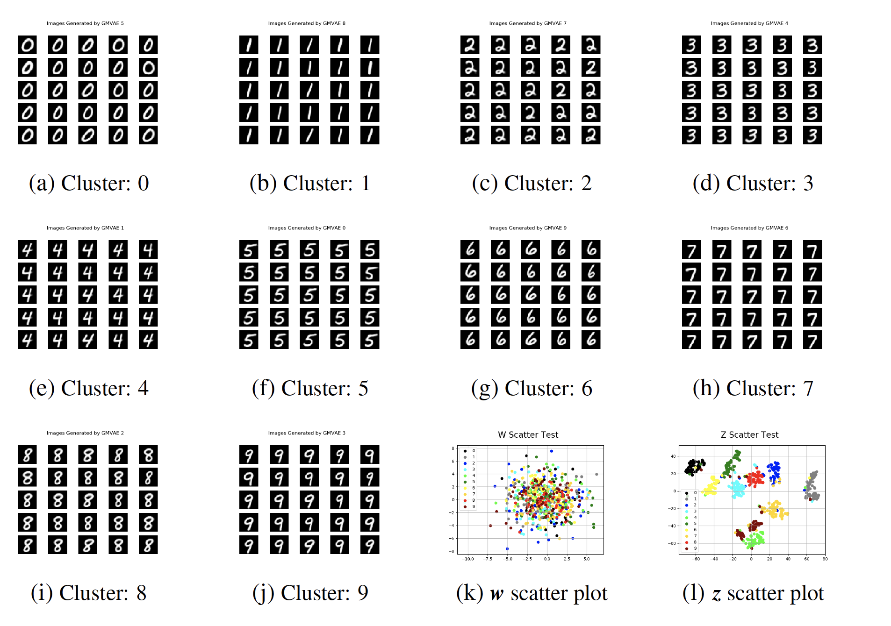
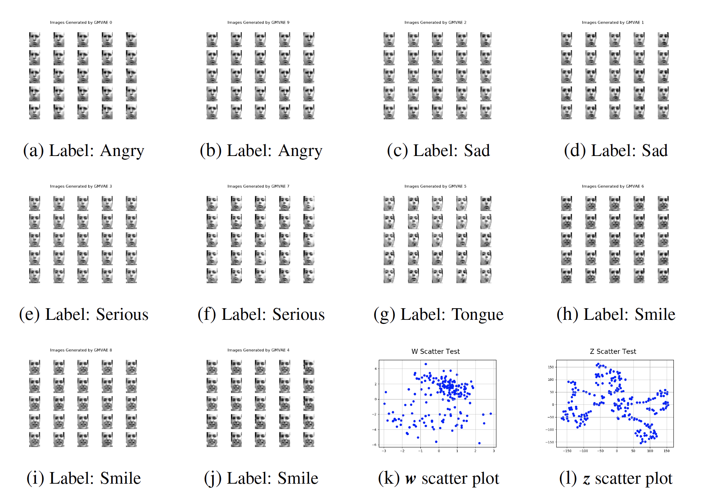

# VAE-GMVAE
This repository contains the implementation of the VAE and Gaussian Mixture VAE using TensorFlow. The VAE implementation  is completeley based on the model described in [link](https://arxiv.org/pdf/1606.05908.pdf) and the GMVAE implementation is based on the model presented in [link](https://arxiv.org/pdf/1611.02648.pdf) with some modifications in the optimization function and the implementation of some distributions. These modifications are described in the Chapter 4 of this bachelor thesis (not available yet).

## Dependencies
1. Install [Tensorflow](https://www.tensorflow.org/get_started/os_setup)
2. Install [Matplotlib](https://matplotlib.org/index.html)
3. Install [Numpy](http://www.numpy.org/)

## Graphical model

The image below shows the graphical model for the VAE.The variable x represents the input data and the variable z represents the latent space. The left part is the generative model and the right part is the inference model.

<p align="center">

</p>
The image below shows the graphical model for the GMVAE.The variable x represents the input data and the variables w,y,z represent the latent space. The left part is the generative model and the right part is the inference model.

<p align="center">

</p>

For a complete explanation of both models see Chapter 3 and Chapter 4 of the bachelor thesis (soon available).

## Hyperparameters
The following hyperparameters are defined. Some of them handle the files
generated, others deal with saving and restoring a model and others determine certain aspects
of the algorithm.

Parameters to handle aspects of the training process and the neural networks:
```
  --model_name MODEL_NAME           Fixes the model and architecture
--dataset_name DATASET_NAME       MNIST or FREY
  --epochs EPOCHS                   Number of epochs for training
  --batch_size BATCH_SIZE           Number of inputs used for each iteration
  --sigma SIGMA                     Parameter that defines the variance of the output Gaussian distribution
  --learning_rate LEARNING_RATE     Parameter of the optimization function
  --z_dim Z_DIM                     Dimension of the latent variable z
  --w_dim W_DIM                     Dimension of the latent variable w. Only for GMVAE
  --K_clusters K_CLUSTERS           Number of modes of the latent variable z. Only for GMVAE
  --hidden_dim HIDDEN_DIM           Number of neurons of each dense layer
  --num_layers NUM_LAYERS           Number of dense layers in each network
```

Parameters to set  checkpoint, results, log and data directories:

```
  --checkpoint_dir CHECKPOINT_DIR   Directory name to save the checkpoints
  --result_dir RESULT_DIR           Directory name to save the generated images
  --log_dir LOG_DIR                 Directory name to save training logs
  --data_dir DATA_DIR               Directory for storing input data
```
Parameters used to enable/disable training, tensorboard summay, model load, plot and generation of results:
```
  --train TRAIN                     Flag to set train
  --summary SUMMARY                 Flag to set TensorBoard summary
  --restore RESTORE                 Flag to restore model
  --plot PLOT                       Flag to set plot
  --generate GENERATE               Flag to set generation
```
Other parameters:
```
  --save_step SAVE_STEP             Save network each X epochs
  --num_imgs NUM_IMGS               Images to plot
  --extra_name EXTRA_NAME           Extra name to identify the model
```
## Architecture selection
The selection of an architecture is done through the model_name parameter. It can take the following values:

- model1: VAE implemented using dense neural networks. [VAE.py]
- model2: VAE implemented using CNNs. [VAE.py]
- model3: GMVAE test with only one latent variable (instability issues). [VAE.py]
- model4_bias: GMVAE implemented using dense neural networks [GMVAE.py]
- model5: GMVAE implemented using CNNs. [GMVAE.py]

## Saved models

Models are saved following the following naming. For the VAE it has 7 fields:

```
{model_name}_{dataset_name}_{epochs}_{sigma}_{dim_Z}_{hidden_dim}_{num_layers}
```

For the GMVAE it has the previous field plus "dim_Z" and "K_clusters", which makes 9 in total:

```
{model_name}_{dataset_name}_{epochs}_{sigma}_{dim_Z}_{dim_W}_{hidden_dim}_{num_layers}_{K_clusters}
```

Example: model5_MNIST_300_001_10_2_128_3_10
## TensorBoard
It is possible to visualize the evolution of parameters during training and the latent variables in TensorBoard. It can be done executing the tensorboard command indicating the log folder of the trained model:

```
tensorboard--logdir=LOGDIR/MODEL_SAVED/
```

For example, if the following model's configuration is trained:
```
python3 GMVAE.py --epochs=300 --sigma=0.001 --z_dim=10 --w_dim=2 --hidden_dim=128 --num_layers=3 --K_clusters=10 --num_imgs=300 --learning_rate=1e-3 --dataset_name=MNIST --model_name=model5 --train=1 --restore=0 --plot=0 --generate=1
```
then it is possible to open TensorBoard and see the parameters of the previous model:
```
tensorboard --logdir=./tensorflow/logdir/model5_MNIST_300_0001_10_2_128_3_10/
```
Tensorflow will be opened in a browser and you will see 5 tabs: SCALARS, GRAPHS, DISTRIBUTIONS, HISTOGRAMS AND PROJECTO. The two screenshots below show the PROJECTOR tab, which shows several inputs images projected in the latent space through t-SNE.

<p align="center">

</p>

<p align="center">

</p>

## Examples of use
Training and generation of model1 using MNIST dataset:

```
python3 VAE.py --epochs=300 --z_dim=10 --hidden_dim=64 --num_layers=3 --sigma=0.001 --num_imgs=300 --model_name=model1 --dataset_name=MNIST --train=1 --restore=0 --plot=0 --generate=1
```

Load previously trained model5 using FREY dataset, generate results and plot them:
```
python3 GMVAE.py --epochs=300 --sigma=0.001 --z_dim=10 --w_dim=2 --hidden_dim=64 --num_layers=3 --K_clusters=10 --num_imgs=300 --learning_rate=1e-3 --dataset_name=FREY --model_name=model5 --train=1 --restore=0 --plot=0 --generate=1
```
## Results
In the title of the generated images "Images generated by GMVAE X" the "X" refers to the cluster index, not to the actual class.
### model1
Good generative result:
<p align="center">

</p>

Good clustering result:
<p align="center">

</p>

### model2
<p align="center">

</p>


### model4_bias
<p align="center">

</p>


### model5
Using MNIST dataset:
<p align="center">

</p>

Using FREY dataset, the labels have been manually:
<p align="center">

</p>


## Acknowledgments
- C. Doersch, “Tutorial on Variational Autoencoders,” ArXiv e-prints, Jun. 2016. arXiv: <https://arxiv.org/pdf/1606.05908.pdf>
- N. Dilokthanakul et al., “Deep Unsupervised Clustering with Gaussian Mixture Variational Autoencoders,” ArXiv e-prints, Nov. 2016. arXiv: <https://arxiv.org/pdf/1611.02648.pdf>
